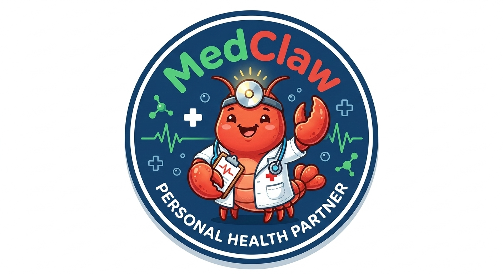

<p align="center">
  
</p>

<h1 align="center">MedClaw</h1>

<p align="center">
  <strong>Your Intelligent Medical Assistant. Your Health, Your Control.</strong>
</p>

<p align="center">
  <a href="README_zh.md">中文</a>&nbsp; • &nbsp;
  <a href="docs/MEDICAL_SKILLS.md">Skills Reference</a>
</p>

---

## Overview

MedClaw is a personal AI medical assistant that runs Claude agents securely in isolated containers. Built on top of [NanoClaw](https://github.com/qwibitai/nanoclaw), it extends the core platform with a suite of medical-grade skills — from biomedical database queries and literature search to patient document simplification and clinical exam preparation.

MedClaw connects to your messaging channels (Feishu, WhatsApp, Telegram, and more) so your medical assistant is always one message away. Each conversation group runs in its own sandboxed container with isolated memory, keeping your health data private and secure.

**What makes MedClaw different:**
- Medical-focused skill set built on top of a minimal, auditable codebase
- Agents run in Linux containers — true OS-level isolation, not application-level permission checks
- No telemetry, no cloud storage, no third-party data sharing
- Fully customizable — modify the code to fit your exact needs

---

## Quick Start

```bash
git clone https://github.com/MedClaw-Org/MedClaw.git
cd MedClaw
claude
```

Then run `/setup`. Claude Code handles everything: dependencies, authentication, container setup, and service configuration.

> **Note:** Commands prefixed with `/` (like `/setup`, `/add-feishu`) are Claude Code skills. Type them inside the `claude` CLI prompt, not in your regular terminal.

### Requirements

- macOS or Linux
- Node.js 20+
- [Claude Code](https://claude.ai/download)
- [Docker](https://docker.com/products/docker-desktop) (macOS/Linux)

---

## Architecture

```
Channels (Feishu / WhatsApp / Telegram / ...)
    ↓
SQLite message store
    ↓
Polling loop (src/index.ts)
    ↓
Container (Claude Agent SDK + Medical Skills)
    ↓
Response routed back to channel
```

Single Node.js process. Channels self-register at startup — the orchestrator connects whichever ones have credentials present. Agents execute in isolated Linux containers with per-group filesystem isolation. IPC via filesystem.

**Key files:**

| File | Purpose |
|------|---------|
| `src/index.ts` | Orchestrator: state, message loop, agent invocation |
| `src/channels/registry.ts` | Channel registry (self-registration at startup) |
| `src/container-runner.ts` | Spawns agent containers with volume mounts |
| `src/router.ts` | Message formatting and outbound routing |
| `src/task-scheduler.ts` | Runs scheduled tasks |
| `src/db.ts` | SQLite operations |
| `container/skills/` | Medical skills loaded into every agent container |
| `groups/{name}/CLAUDE.md` | Per-group memory (isolated) |

---

## Skills

Medical skills are loaded automatically into every agent container from `container/skills/`. The agent can invoke them based on context without explicit commands.

| Skill | Description |
|-------|-------------|
| agent-browser | Browse the web — research, screenshots, form interaction, data extraction |
| find-skills | Discover and install new agent skills via the skills ecosystem |
| pubmed-search | Search PubMed for scientific literature using NCBI Entrez API |
| medical-research-toolkit | Query 14+ biomedical databases (ChEMBL, ClinicalTrials.gov, OpenTargets, OpenFDA, OMIM, Reactome, KEGG, UniProt, and more) via unified MCP endpoint |
| medical-specialty-briefs | Generate daily or on-demand research briefs for any medical specialty from top-tier journals |
| usmle | USMLE Step 1/2 CK/Step 3 preparation: progress tracking, weak area analysis, residency match planning |
| medical-entity-extractor | Extract symptoms, medications, lab values, and diagnoses from patient messages |
| patiently-ai | Simplify doctor's letters, test results, prescriptions, and discharge summaries into plain language |
| multi-search-engine | 17-engine search (8 CN + 9 Global): Baidu, Google, DuckDuckGo, WolframAlpha, and more |
| wikipedia-search | Fetch structured encyclopedic content via the MediaWiki API, multi-language support |

Full reference: [docs/MEDICAL_SKILLS.md](docs/MEDICAL_SKILLS.md)

---

## Acknowledgments

MedClaw is built on [NanoClaw](https://github.com/qwibitai/nanoclaw) by [@qwibitai](https://github.com/qwibitai), which in turn draws inspiration from [OpenClaw](https://github.com/openclaw/openclaw). The core architecture — single-process orchestrator, container-isolated agents, skill-based extensibility — comes entirely from NanoClaw.

Medical skills are sourced from the open agent skills ecosystem. See individual skill directories in `container/skills/` for attribution.

---

## License

MIT
