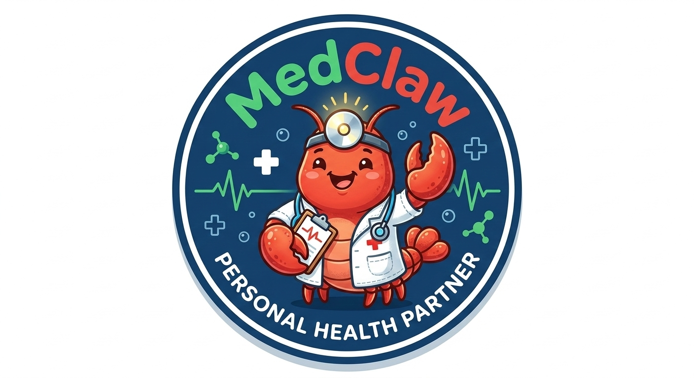

<p align="center">
  
</p>

<h1 align="center">MedClaw</h1>

<p align="center">
  <strong>您的智能医疗助手。您的健康，您做主。</strong>
</p>

<p align="center">
  <a href="README.md">English</a>&nbsp; • &nbsp;
  <a href="docs/MEDICAL_SKILLS_zh.md">技能手册</a>
</p>

---

## 概览

MedClaw 是一款个人 AI 医疗助手，在隔离容器中安全运行 Claude 智能体。基于 [NanoClaw](https://github.com/qwibitai/nanoclaw) 构建，在核心平台之上扩展了一套医疗专业技能——涵盖生物医学数据库查询、文献检索、患者文档简化和临床备考等场景。

MedClaw 可接入消息渠道，让您的医疗助手随时触手可及。当前代码默认包含钉钉、飞书/Lark 和 QQ，其他渠道可通过渠道技能添加。每个已注册群组都有独立的工作区和会话目录，并在隔离容器中运行。

**MedClaw 的特点：**

- 基于极简、可审计代码库构建的医疗专属技能集
- 智能体运行在 Linux 容器中——真正的操作系统级隔离，而非应用层权限检查
- 无 MedClaw 遥测或 MedClaw 托管后端
- 完全可定制——修改代码以满足您的精确需求

**重要数据边界：** 消息会经过您使用的消息平台和 Anthropic；智能体调用网页或医学工具时，相关内容还可能发送到对应网站或 API。消息内容和 Claude 会话记录会以未加密形式保存在本机，系统不会自动到期删除。处理真实患者数据前，请阅读[安全模型](docs/SECURITY.md)。

**医疗安全：** MedClaw 仅提供教育性信息，不能替代医生，也不是急救服务。系统会提示紧急症状、避免直接要求调整处方药并标明不确定性，但模型仍可能出错。如疑似紧急情况，请立即联系当地急救服务。

---

## 快速开始

```bash
git clone https://github.com/MedClaw-Org/MedClaw.git
cd MedClaw
claude
```

然后运行 `/setup`。Claude Code 会处理一切：依赖安装、身份验证、容器设置和服务配置。

> **注意：** 以 `/` 开头的命令（如 `/setup`、`/add-feishu`）是 Claude Code 技能，请在 `claude` CLI 提示符中输入，而非在普通终端中。

### 系统要求

- macOS 或 Linux
- Node.js 20+
- [Claude Code](https://claude.ai/download)
- [Docker](https://docker.com/products/docker-desktop)（macOS/Linux）

---

## 架构

```
消息渠道（钉钉 / 飞书 / QQ / 可选扩展）
    ↓
SQLite 消息存储
    ↓
轮询循环（src/index.ts）
    ↓
容器（Claude Agent SDK + 医疗技能）
    ↓
响应路由回消息渠道
```

单一 Node.js 进程。渠道在启动时自注册，编排器自动连接已配置凭据的渠道。智能体在 Linux 容器中执行，每个群组拥有独立的文件系统隔离。IPC 通过文件系统实现。

### 流式回复

Claude 生成回答时会持续转发文本增量。飞书/Lark 使用原生 CardKit 打字机卡片；钉钉在配置 `DINGTALK_AI_CARD_TEMPLATE_ID` 后使用原生 AI 流式卡片，设置方法见[流式回复说明](docs/STREAMING.md)。QQ 机器人接口目前没有已确认的消息编辑契约，因此会安全降级为一条完整消息。无论使用哪个渠道，SDK 的最终结果都是权威文本；流被中断时也会明确结束卡片状态，不会一直停留在加载中。

**关键文件：**

| 文件                       | 用途                                   |
| -------------------------- | -------------------------------------- |
| `src/index.ts`             | 编排器：状态管理、消息循环、智能体调用 |
| `src/channels/registry.ts` | 渠道注册表（启动时自注册）             |
| `src/container-runner.ts`  | 启动带卷挂载的智能体容器               |
| `src/router.ts`            | 消息格式化与出站路由                   |
| `src/task-scheduler.ts`    | 运行计划任务                           |
| `src/db.ts`                | SQLite 操作                            |
| `container/skills/`        | 自动加载到每个智能体容器的医疗技能     |
| `groups/{name}/CLAUDE.md`  | 各群组独立记忆                         |

---

## 技能

医疗技能从 `container/skills/` 自动加载到每个智能体容器中，智能体可根据上下文无需显式命令地调用它们。

| 技能                     | 说明                                                                                                                           |
| ------------------------ | ------------------------------------------------------------------------------------------------------------------------------ |
| agent-browser            | 浏览器自动化——网页研究、截图、表单交互、数据提取                                                                               |
| pubmed-search            | 通过 NCBI Entrez API 搜索 PubMed 科学文献                                                                                      |
| medical-research-toolkit | 通过统一 MCP 端点查询 14+ 生物医学数据库（ChEMBL、ClinicalTrials.gov、OpenTargets、OpenFDA、OMIM、Reactome、KEGG、UniProt 等） |
| medical-specialty-briefs | 从顶级期刊生成各医学专科的每日或按需研究简报                                                                                   |
| usmle                    | USMLE Step 1/2 CK/Step 3 备考：进度追踪、薄弱点分析、住院医匹配规划                                                            |
| medical-entity-extractor | 从患者消息中提取症状、药物、检验值和诊断                                                                                       |
| patiently-ai             | 将医生信件、检查报告、处方和出院小结转化为通俗易懂的语言                                                                       |
| multi-search-engine      | 17 引擎搜索（8 个国内 + 9 个国际）：百度、Google、DuckDuckGo、WolframAlpha 等                                                  |
| wikipedia-search         | 通过 MediaWiki API 获取百科全书式内容，支持多语言                                                                              |

完整技能手册：[docs/MEDICAL_SKILLS_zh.md](docs/MEDICAL_SKILLS_zh.md)

---

## 致谢

MedClaw 基于 [@qwibitai](https://github.com/qwibitai) 开发的 [NanoClaw](https://github.com/qwibitai/nanoclaw) 构建，NanoClaw 的灵感来源于 [OpenClaw](https://github.com/openclaw/openclaw)。核心架构——单进程编排器、容器隔离智能体、基于技能的可扩展性——完全来自 NanoClaw。

医疗技能来源于开放的智能体技能生态系统。各技能的版权信息请查看 `container/skills/` 下对应目录。

---

## 许可证

MIT
